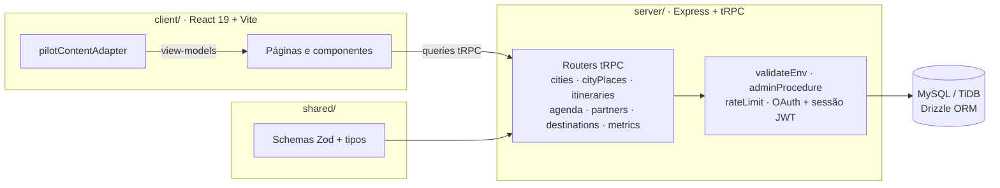

<div align="center">

# Bora Piauí

**Atlas editorial de percursos turísticos do Piauí** — cidades-piloto com curadoria verificável, agenda cultural, patrimônios e rede local de parceiros.

[](https://github.com/samuelbackup/bora-piaui/actions/workflows/ci.yml)


</div>

---

## ✨ O que é

Um protótipo navegável que transforma pesquisa editorial verificável em jornada de descoberta: cada atração, evento ou negócio aparece **com fonte pública e condição operacional declarada** — sem inventar distância, preço ou disponibilidade.

| Jornada                      | Descrição                                                                                                          |
| ---------------------------- | ------------------------------------------------------------------------------------------------------------------ |
| 🗺️ **Atlas estadual**        | Destinos por polo turístico com filtros, busca e mapa sincronizado                                                 |
| 🏙️ **Cidades-piloto**        | Teresina, Cajueiro da Praia e São Raimundo Nonato com atrações, roteiros de 1 dia e leituras de cultura e história |
| 🧭 **Proximidade editorial** | Relações de território entre lugares, ancoradas no mapa                                                            |
| 🤝 **Rede local**            | Formulário público de parceiros + painel de curadoria com revisão editorial                                        |
| 🛡️ **Administração**         | Login OAuth, papel `admin` no servidor e painéis protegidos por `adminProcedure`                                   |

## 🏛️ Arquitetura



**Camadas isoladas**: `client` nunca importa servidor; contratos traficam por tRPC; validação Zod única entre bordas; segredos validados em fail-fast no boot.

## 🚀 Começo rápido

```bash
# 1. Banco MySQL local (requer Docker)
pnpm db:up                    # sobe mysql:8 em localhost:3306 (root/root, db bora_piaui)

# 2. Variáveis de ambiente
cp .env.example .env          # DATABASE_URL já casa com o compose

# 3. Schema + dados iniciais
pnpm db:push                  # migrations 0000 → 0004
pnpm db:seed                  # catálogo canônico idempotente

# 4. Aplicação
pnpm dev                      # http://localhost:3000
```

> Sem banco ativo, a UI permanece navegável com estados de carregamento/erro desenhados — nenhum dado falso é exibido.

## 🧪 Qualidade

```bash
pnpm verify   # lint (Prettier) + tipos (tsc) + testes (Vitest) — o mesmo gate do CI
```

| Verificação | Cobertura                                                                                                 |
| ----------- | --------------------------------------------------------------------------------------------------------- |
| `lint`      | Formatação Prettier em `client/server/shared`                                                             |
| `check`     | TypeScript estrito, sem emissão                                                                           |
| `test`      | 19 suítes: autorização FORBIDDEN, esquemas de URL, seed idempotente, routers tRPC, rate limit, CSV seguro |
| `scripts/`  | Validações E2E Playwright (agenda editorial, jornada da cidade)                                           |

## 🔐 Segurança embarcada

- `validateEnv()` no boot: `JWT_SECRET` obrigatório (≥32 caracteres em produção) antes de abrir portas
- CRUD editorial somente em `adminProcedure`; escrita pública com rate limit
- URLs externas restritas a `https:` em produção (bloqueia `javascript:`/`data:`)
- Sessão JWT HS256 revogável com OAuth state + nonce CSRF (`__Host-` cookie)

## 📁 Estrutura

```
client/    React 19 · páginas, componentes, adaptadores de catálogo
server/    Express + tRPC · routers, _core (auth, env, rate limit) · drizzle/ (schema + migrations) · db/ (seed)
shared/    Schemas Zod e tipos compartilhados
docs/      architecture · research · validation · plans
scripts/   Validações E2E Playwright
```

## 📚 Documentação

| Pasta                                      | Conteúdo                                                          |
| ------------------------------------------ | ----------------------------------------------------------------- |
| [`docs/architecture/`](docs/architecture/) | Blueprint de back-end, plano de migração, contratos de integração |
| [`docs/research/`](docs/research/)         | Fontes editoriais: Teresina, patrimônios, cidades-piloto          |
| [`docs/validation/`](docs/validation/)     | Relatórios históricos de E2E, staging e deploy                    |
| [`docs/plans/`](docs/plans/)               | Ideias, TODOs e planos editoriais                                 |

## 🗺️ Próximos passos

- [ ] Rate limit por origem nas escritas restantes e DTOs públicos/administrativos distintos
- [ ] Paginação nas listagens administrativas + índices previstos no plano de migração
- [ ] Exportação CSV com neutralização de fórmulas já restrita a admin
- [ ] Migração do acervo estático restante (`mvpPlaces`) para o banco

## Licença

MIT
